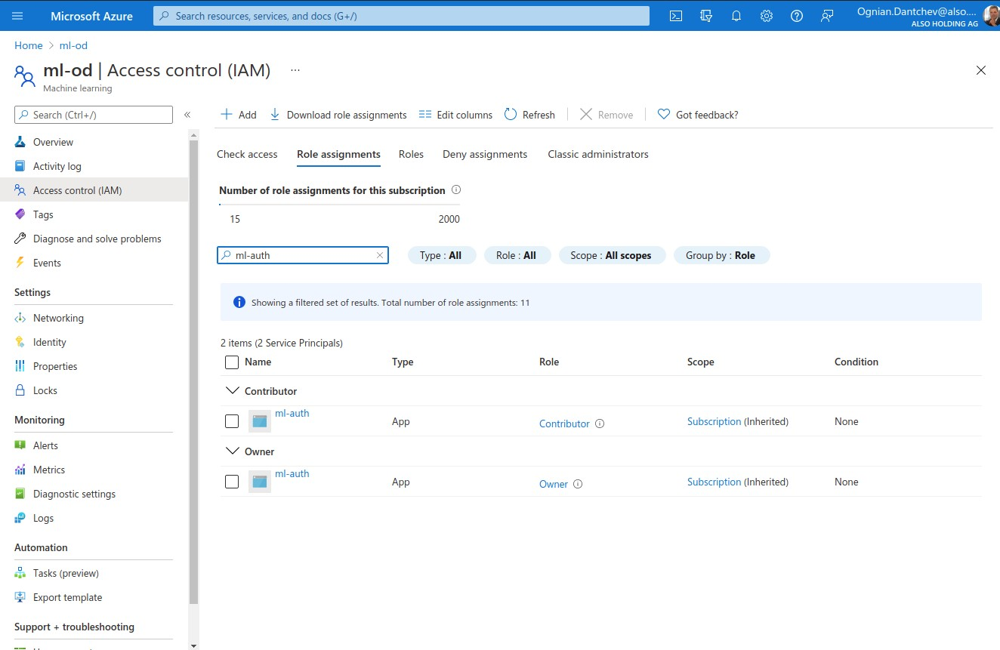

## Step 1: Authentication

az

az extension list

az login

az ad sp create-for-rbac --sdk-auth --name ml-auth

--sdk-auth has been deprecated and will be removed in version '3.0.0'

## Step 2: Automated ML Experiment

